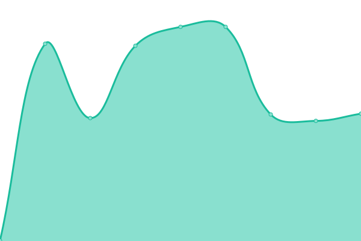
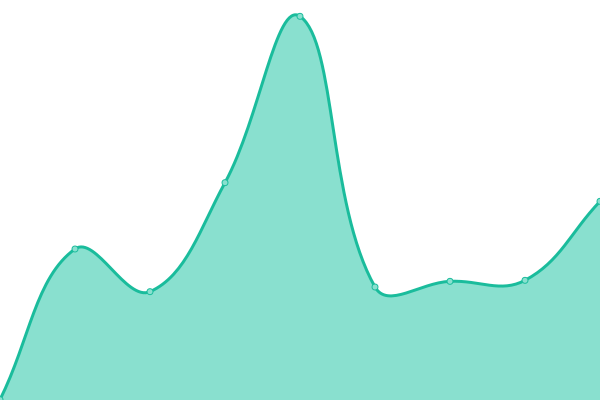
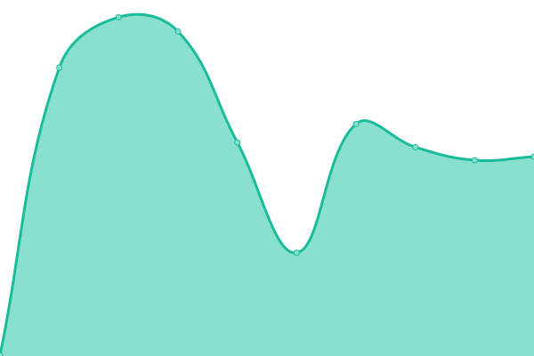
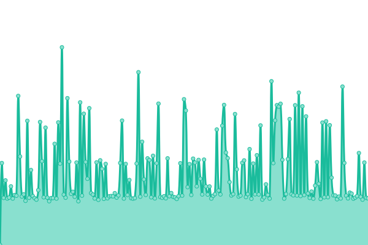
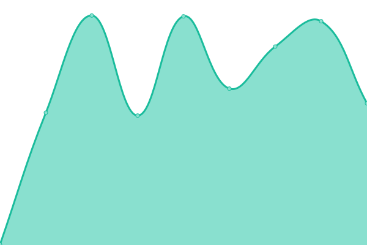
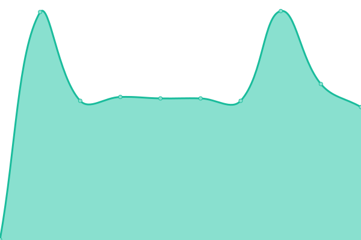
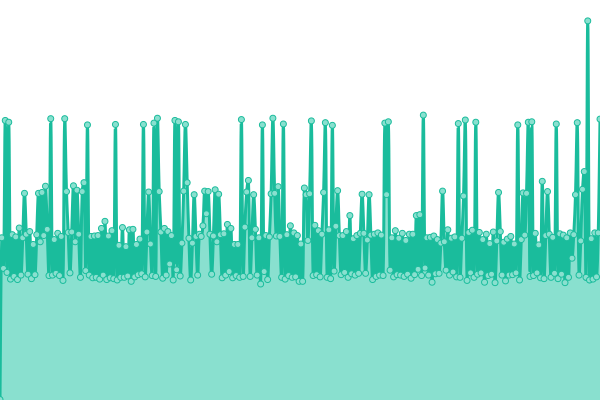
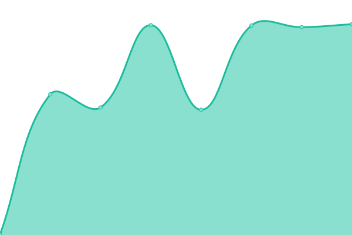

# [📈 Live Status](https://uptime.andrewdavies.net): <!--live status--> **🟩 All systems operational**

This repository contains the open-source uptime monitor and status page for [Andrew Davies](andrewdavies.net), powered by [Upptime](https://github.com/upptime/upptime).

With [Upptime](https://upptime.js.org), you can get your own unlimited and free uptime monitor and status page, powered entirely by a GitHub repository. We use [Issues](https://github.com/andrewdavies-net/upptime/issues) as incident reports, [Actions](https://github.com/andrewdavies-net/upptime/actions) as uptime monitors, and [Pages](https://uptime.andrewdavies.net) for the status page.

<!--start: status pages-->
<!-- This summary is generated by Upptime (https://github.com/upptime/upptime) -->
<!-- Do not edit this manually, your changes will be overwritten -->
<!-- prettier-ignore -->
| URL | Status | History | Response Time | Uptime |
| --- | ------ | ------- | ------------- | ------ |
|  sdc | 🟩 Up | [sdc.yml](https://github.com/andrewdavies-net/upptime/commits/HEAD/history/sdc.yml) | 

 450ms
     
 | 

<a href="https://uptime.andrewdavies.net/history/sdc">40.10%</a>
    

|  nh | 🟩 Up | [nh.yml](https://github.com/andrewdavies-net/upptime/commits/HEAD/history/nh.yml) | 

 540ms
     
 | 

<a href="https://uptime.andrewdavies.net/history/nh">40.10%</a>
    

|  sso | 🟩 Up | [sso.yml](https://github.com/andrewdavies-net/upptime/commits/HEAD/history/sso.yml) | 

 327ms
     
 | 

<a href="https://uptime.andrewdavies.net/history/sso">40.10%</a>
    

|  jellyfin | 🟩 Up | [jellyfin.yml](https://github.com/andrewdavies-net/upptime/commits/HEAD/history/jellyfin.yml) | 

 632ms
     
 | 

<a href="https://uptime.andrewdavies.net/history/jellyfin">40.10%</a>
    

|  nhcam | 🟩 Up | [nhcam.yml](https://github.com/andrewdavies-net/upptime/commits/HEAD/history/nhcam.yml) | 

 831ms
     
 | 

<a href="https://uptime.andrewdavies.net/history/nhcam">22.08%</a>
    

|  pass | 🟩 Up | [pass.yml](https://github.com/andrewdavies-net/upptime/commits/HEAD/history/pass.yml) | 

 298ms
     
 | 

<a href="https://uptime.andrewdavies.net/history/pass">39.96%</a>
    

|  plex | 🟩 Up | [plex.yml](https://github.com/andrewdavies-net/upptime/commits/HEAD/history/plex.yml) | 

 344ms
     
 | 

<a href="https://uptime.andrewdavies.net/history/plex">39.96%</a>
    

|  plexd | 🟩 Up | [plexd.yml](https://github.com/andrewdavies-net/upptime/commits/HEAD/history/plexd.yml) | 

 388ms
     
 | 

<a href="https://uptime.andrewdavies.net/history/plexd">22.84%</a>
    

|  requests | 🟩 Up | [requests.yml](https://github.com/andrewdavies-net/upptime/commits/HEAD/history/requests.yml) | 

 573ms
     
 | 

<a href="https://uptime.andrewdavies.net/history/requests">39.97%</a>
    

<!--end: status pages-->

[**Visit our status website →**](https://uptime.andrewdavies.net)

## 📄 License

- Powered by: [Upptime](https://github.com/upptime/upptime)
- Code: [MIT](./LICENSE) © [Andrew Davies](andrewdavies.net)
- Data in the `./history` directory: [Open Database License](https://opendatacommons.org/licenses/odbl/1-0/)
